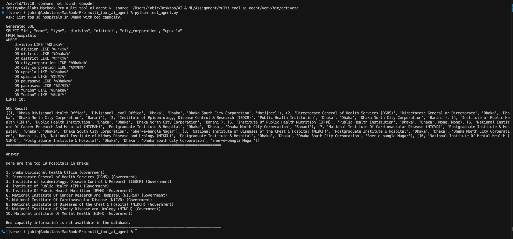
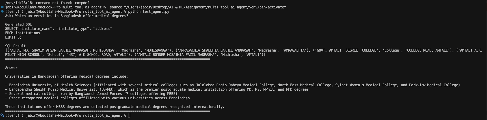
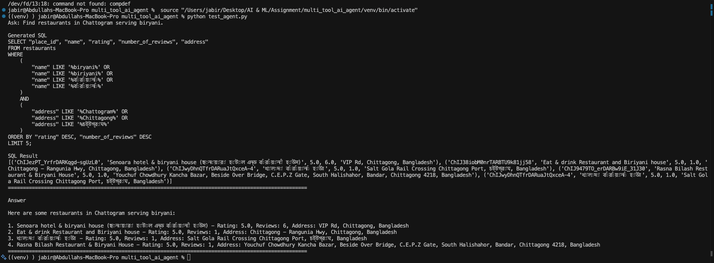
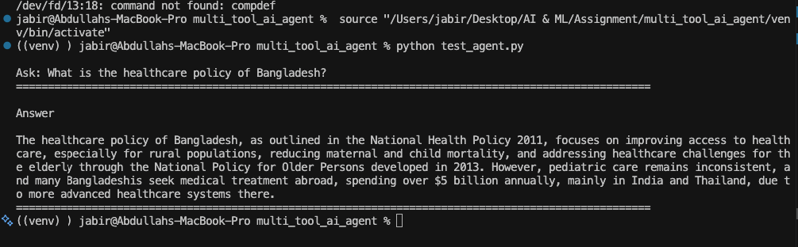
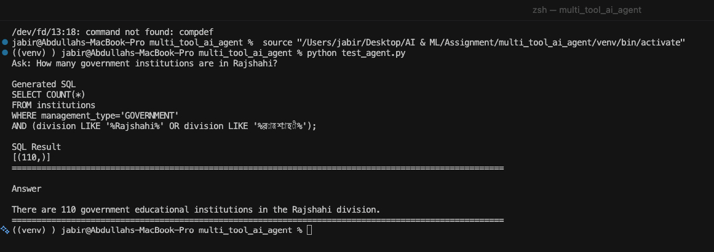

# 🇧🇩 Bangladesh Multi-Tool AI Agent

## 🎥 Demo Video

**Watch the full project demo here:**

https://drive.google.com/file/d/12X3feJodUREc7fGSVtM5yksYJ-o0S7Mc/view?usp=sharing

---

## 📸 Demo Screenshots

### Question 1: List top 10 hospitals in Dhaka with bed capacity.



---

### Question 2: Which universities in Bangladesh offer medical degrees?



---

### Question 3: Find restaurants in Chattogram serving biryani.



---

### Question 4: What is the healthcare policy of Bangladesh?



---

### Question 5: How many government institutions are in Rajshahi?



---

# Project Overview

This project is an AI-powered ReAct agent capable of answering user questions by intelligently selecting the appropriate data source or search tool.

The agent supports information retrieval from multiple Bangladesh-related datasets and falls back to web search when the required information is unavailable in the local databases.

The project is built using **Python**, **LangChain**, **OpenAI GPT**, **SQLite**, and **Pandas**.

---

# Overall Architecture

```text
                    ┌─────────────────────────┐
                    │      User Question      │
                    └────────────┬────────────┘
                                 │
                                 ▼
                    ┌─────────────────────────┐
                    │      ReAct AI Agent     │
                    └────────────┬────────────┘
                                 │
             ┌───────────────────┼───────────────────┐
             │                   │                   │
             ▼                   ▼                   ▼
     Hospitals Tool      Institutions Tool    Restaurants Tool
             │                   │                   │
             ▼                   ▼                   ▼
     Hospital Service    Institution Service  Restaurant Service
             │                   │                   │
             ▼                   ▼                   ▼
       SQL Generation      SQL Generation      SQL Generation
             │                   │                   │
             ▼                   ▼                   ▼
       SQLite Database     SQLite Database     SQLite Database
             │                   │                   │
             └───────────────────┼───────────────────┘
                                 │
                                 ▼
                      Natural Language Response
                                 │
                                 ▼
                            Final Answer

                    (Fallback when data is unavailable)

                                 │
                                 ▼
                         Web Search Tool
                                 │
                                 ▼
                            Search Results
                                 │
                                 ▼
                      Natural Language Response
```

### Architecture Flow

1. The user submits a natural language question.
2. The ReAct AI Agent analyzes the question and selects the most appropriate tool.
3. The selected service expands keywords (such as English/Bangla locations when applicable).
4. The LLM generates a SQLite query based on the database schema.
5. SQL post-processing validates and adjusts the generated query when necessary.
6. The query is executed against the corresponding SQLite database.
7. The SQL result is converted into a concise natural language response.
8. If the required information is unavailable in the local databases, the agent automatically falls back to the Web Search Tool.
9. The final answer is returned to the user.

---

# Features

- ReAct AI Agent
- Automatic tool selection
- Natural language to SQL generation
- SQLite database querying
- Restaurant search
- Hospital search
- Educational institution search
- Web search fallback
- Location-aware queries
- English and Bangla keyword expansion
- SQL post-processing
- Natural language response generation

---

# Available Tools

### 🏥 Hospitals Database

Supports queries such as:

- Hospitals in Dhaka
- Government hospitals
- Private hospitals
- Hospital counts
- Medical college hospitals
- Hospital locations

---

### 🎓 Educational Institutions Database

Supports queries such as:

- Schools
- Colleges
- Universities
- EIIN lookup
- MPO status
- Institution counts
- Affiliation
- Educational level

---

### 🍽 Restaurants Database

Supports queries such as:

- Top restaurants
- Restaurant ratings
- Restaurant locations
- Restaurants by cuisine
- Restaurant counts

---

### 🌐 Web Search

Automatically used when information is unavailable in the local databases.

Examples include:

- Government policies
- Healthcare policies
- General knowledge
- Current events

---

# Project Structure

```text
multi_tool_ai_agent/
│
├── app/
│   ├── agent/
│   ├── database/
│   ├── prompts/
│   ├── schemas/
│   ├── services/
│   ├── tools/
│   ├── utils/
│   └── llm.py
│
├── datasets/
│
├── explore/
│
├── requirements.txt
├── test_agent.py
└── README.md
```

---

# Technologies Used

- Python
- LangChain
- OpenAI GPT
- SQLite
- Pandas
- DuckDuckGo Search
- SQLAlchemy

---

# Installation

Clone the repository

```bash
git clone https://github.com/ghorardim/multi_tool_ai_agent.git

cd multi_tool_ai_agent
```

Create a virtual environment

```bash
python -m venv venv
```

Activate the environment

macOS/Linux

```bash
source venv/bin/activate
```

Windows

```bash
venv\Scripts\activate
```

Install dependencies

```bash
pip install -r requirements.txt
```

---

# Environment Variables

Create a `.env` file in the project root.

Example:

```text
OPENAI_API_KEY=your_api_key
OPENAI_API_BASE=your_api_base
OPENAI_MODEL=gpt-4.1-mini
```

---

# Run the Project

```bash
python test_agent.py
```

Example

```text
Ask: List top restaurants in Dhaka

Ask: How many government hospitals are in Rajshahi?

Ask: Find colleges in Khulna.

Ask: What is the healthcare policy of Bangladesh?
```

---

# Intelligent Features

- ReAct reasoning
- Automatic tool selection
- SQL generation using LLM
- SQL validation
- SQL post-processing
- Location normalization
- English/Bangla keyword expansion
- Natural language answer generation

---

# Future Improvements

- Streamlit web interface
- Conversation memory
- Hybrid SQL + Vector Search
- RAG integration
- More Bangladesh datasets
- API deployment
- Docker support

---

# Author

**Abdullah Al Mahmud Jabir**
- LinkedIn: https://linkedin.com/in/abdullah-al-mahmud-jabir